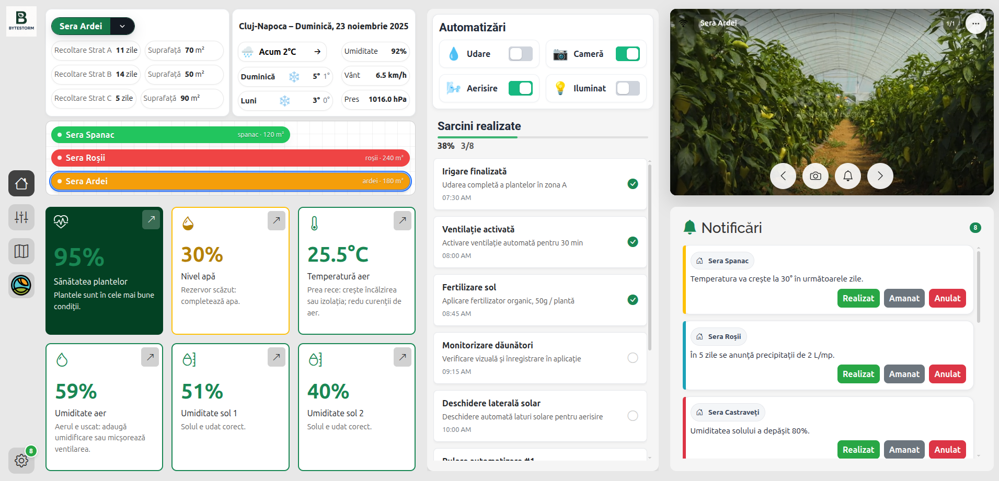
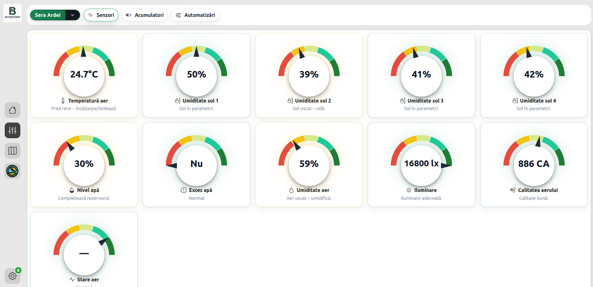
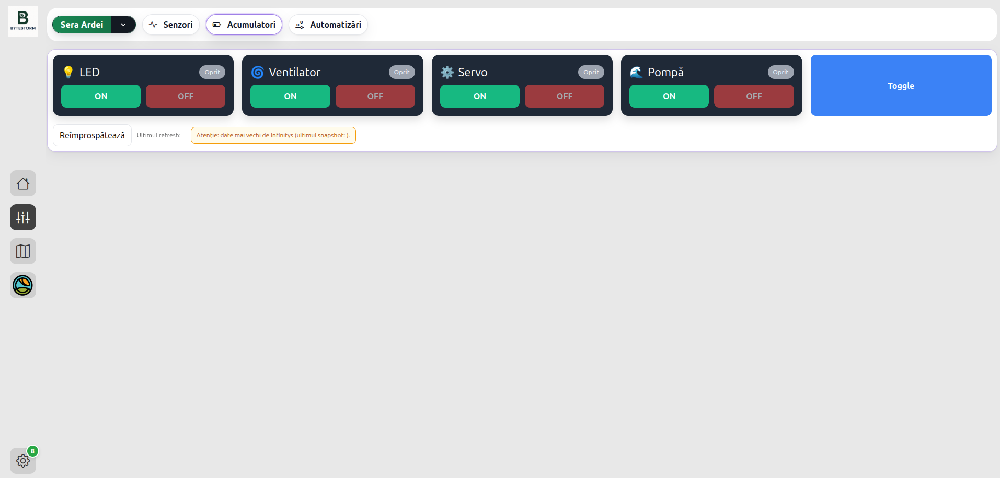
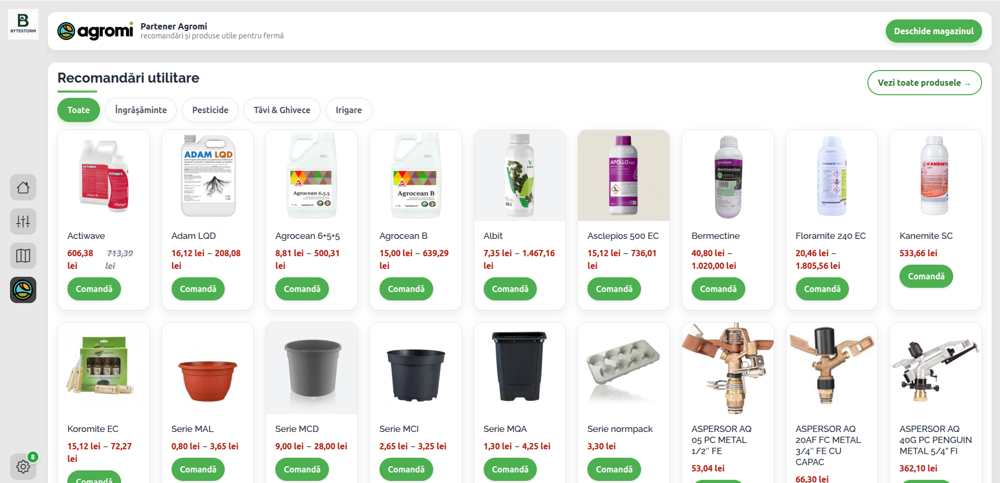
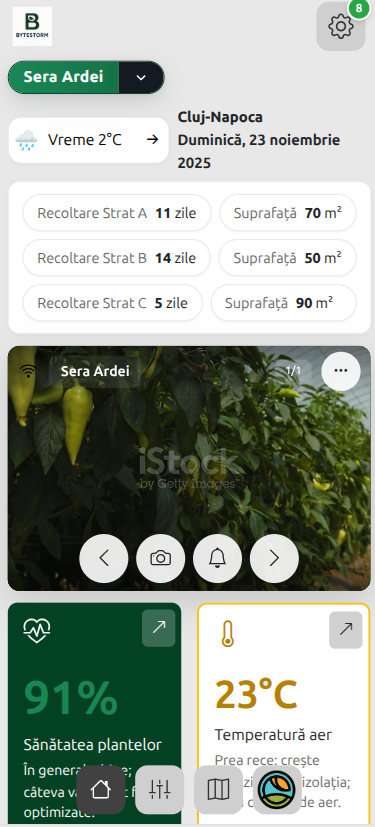

# 🌱 Smart Greenhouse – Complete IoT Monitoring & Automation Platform  
**Full Stack Project:** React + Node.js + MQTT + Raspberry Pi + MySQL

---
## 🔗 Live Demo

Proiectul este disponibil live, găzduit pe infrastructura mea proprie:

👉 **https://serty.ro**

Acesta rulează pe un server pe care îl administrez personal, incluzând:
- configurare Nginx / Apache
- build & deploy pentru frontend (Vite)
- backend Node.js cu procese persistente
- securizare domeniu (HTTPS + certificare)
- management complet al serverului

---

## 📌 Descriere generală

**Smart Greenhouse** este o platformă completă de monitorizare și automatizare a unei sere inteligente, construită cap-coadă cu tehnologii moderne web și IoT.

Proiectul include:

- **Frontend (React + Vite)**  
  Dashboard în timp real, streaming video live, grafice, hartă interactivă, control actuatori, notificări și sistem de setări.

- **Backend (Node.js + Express + MQTT)**  
  API REST, procesare date senzori, autentificare, logica actuatorilor, comunicare cu Raspberry Pi Pico.

- **Hardware (Raspberry Pi 4 + Raspberry Pi Pico + senzori)**  
  Acest layer nu este inclus în repository. Comunicare cu backend-ul prin MQTT.

Platforma demonstrează competențe solide în:

- full stack development  
- IoT integration  
- real-time systems  
- UX/UI design  
- arhitecturi scalabile  

---

## 🧱 Arhitectura proiectului

sera-smart/
│── backend/ 
→ Node.js + Express + MQTT + MySQL API
│── frontend/ 
→ React + Vite responsive dashboard
└── README.md → Documentația principală

---

👤 Rol personal în proiect (Full Stack & IoT Developer)
Am contribuit majoritar sau integral la:

arhitectura completă a aplicației

design UI/UX și implementarea completă a frontend-ului

dezvoltarea backend-ului (API REST + MQTT)

integrarea cu hardware-ul Raspberry Pi / Pico

testare, debugging, structurare, documentație

coordonarea echipei și definirea fluxurilor de lucru

stabilirea logicii generale și a componentelor aplicației

Acest proiect reprezintă o demonstrație practică a abilităților mele ca full stack developer și IoT engineer.

## 🖼️ Screenshots

Mai jos sunt câteva capturi reale din aplicația Smart Greenhouse, demonstrând funcționalitatea dashboard-ului, statisticilor, controlului actuatorilor, integrării Agromi și versiunea mobilă.

---

### 🌍 Dashboard principal (desktop)



Dashboard-ul principal oferă o vedere de ansamblu asupra stării serei: sănătatea plantelor, nivelul apei, temperatura aerului, umiditatea solului, automatizări active, sarcini realizate și notificări.

---

### 📊 Pagina de Statistici (senzori în timp real)



Grafică avansată cu analize pe intervale (24h, 7 zile, 30 zile), comparare senzori, detectare comportamente anormale și tendințe în timp.

---

### ⚙️ Control Actuatori (LED, Ventilator, Servo, Pompă)



Permite controlul direct al sistemelor din seră: ventilatoare, iluminat, servo-motoare, pompa de apă. Comenzile sunt trimise în timp real prin backend → MQTT → Raspberry Pi.

---

### 🛒 Integrare Agromi – Recomandări și produse agricole



Integrare completă cu Agromi, afișând recomandări dinamice pentru: îngrășăminte, pesticide, tăvi & ghivece, sisteme de irigat și alte produse utile în agricultură.

---

### 📱 Dashboard – versiune mobilă



Interfața este optimizată complet pentru mobil, păstrând accesul la toate funcțiile: live camera, senzori, notificări, prognoză meteo, automatizări și control.

---

## 🔹 Componentele proiectului

---

# 1. Frontend – Smart Dashboard (React + Vite)

**Folder:** `/frontend`

### 🟦 Funcționalități cheie

- Dashboard senzori în timp real  
- Grafice (24h, 7 zile, 30 zile)  
- Hartă interactivă a serelor  
- Sistem complet de notificări  
- Control actuatori (udare, ventilație, iluminare)  
- Streaming video live de la camere USB conectate la Raspberry Pi  
- Autentificare cu JWT  
- UI complet responsive pentru desktop/tabletă/mobil  

### 🟩 Rol în proiect

Frontend-ul a fost dezvoltat aproape integral de mine:

- am conceput și implementat design-ul complet (UI/UX)  
- am structurat codul (componente, hooks, pagini, utilitare)  
- am creat toate paginile și logica aplicației  
- am integrat video streaming & actualizări live  
- am optimizat responsive design pentru orice dispozitiv  

Documentație dedicată:  
[`/frontend/README.md`](./frontend/README.md)

---

# 2. Backend – API REST + MQTT Broker Client (Node.js)

**Folder:** `/backend`

### 🟦 Funcționalități cheie

- Endpoint-uri REST pentru senzori, utilizatori, statistici și control  
- Procesarea datelor trimise de Raspberry Pi Pico prin MQTT  
- Autentificare JWT + hashing parole  
- Salvare date senzori în MySQL  
- Trimitere comenzi către actuatori via MQTT  
- Logica business completă pentru automatizare  

### 🟩 Rol în proiect

- am implementat endpoint-uri, controlere și middleware  
- am construit structura bazei de date  
- am dezvoltat integrarea MQTT (ingestie + control actuatori)  
- am realizat testarea API cu Postman  
- am definit arhitectura backend-ului conform standardelor profesionale  

Documentație dedicată:  
[`/backend/README.md`](./backend/README.md)

---

# 3. Layer Hardware (non-public)

Backend-ul și frontend-ul au fost testate pe infrastructură reală:

- **Raspberry Pi 4** → rulează `mjpg-streamer` și gateway video  
- **Raspberry Pi Pico W** → colectează date din senzori și controlează actuatori  
- **Senzori utilizați:** DHT22, LDR, soil moisture, senzori de aer cald/rece  
- **Protocol comunicație:** MQTT over WiFi  

Infrastructura este complet funcțională și testată în scenarii reale.

---

## ⚙️ Tehnologii utilizate (overview)

### 🖥️ Frontend
- React 18  
- Vite  
- CSS modular  
- Hooks personalizate  
- Live MJPEG streaming  
- Fetch API / Axios  

### 🔧 Backend
- Node.js  
- Express  
- MySQL2  
- MQTT.js  
- dotenv  
- bcryptjs  
- jsonwebtoken  

### 🌡️ Hardware & IoT
- Raspberry Pi 4  
- Raspberry Pi Pico W  
- MQTT  
- mjpg-streamer  
- Multiple sensors & actuators  

---


## 🚀 Capabilitățile principale ale platformei

- Integrare completă **IoT → backend → frontend**  
- Actualizare în timp real a datelor  
- Control actuatori cu feedback instant  
- Arhitectură scalabilă pentru multiple sere  
- UI/UX modern, responsive și optimizat  
- Management securizat al utilizatorilor  
- Colectare și analiză istorică pentru senzori  

---

## ▶️ Cum rulezi proiectul local

### 1. Backend

```bash
cd backend
npm install
npm run dev
2. Frontend
bash
Copy code
cd frontend
npm install
npm run dev
3. Accesare aplicație
arduino
Copy code
http://localhost:5173


